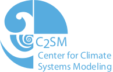

# pyvis - Python Visualisation Course - c2sm - version 2

* Mathias Hauser ([ETHZ](http://www.iac.ethz.ch/people-iac/person-detail.html?persid=146568), [github](https://github.com/mathause)) <mathias.hauser@env.ethz.ch>
* Tarun Chadha  ([ETHZ](https://www.ethz.ch/services/en/organisation/departments/it-services/people/person-detail.html?persid=166149), [github](https://github.com/chadhat)) <tarun.chadha@id.ethz.ch>

## Format

The lectures consist of IPython Notebooks.

## Audience

Python beginners who should have programming experience in other
languages. Most examples and exercises are drawn from the field
of Climate Reseach.

## Duration

It's envisioned as a two day course.

## How to use it

### 1 Obtain the course material

Clone the git repository:

~~~~bash
git clone https://github.com/C2SM/pyvis.git
~~~~

Alternatively, you can download the [zip-archive](https://github.com/C2SM/pyvis/archive/master.zip)
and unpack.

### 2 Start jupyter notebook

#### In the computer room at ETH (HG D 12)

Click for details

 * log in to Fedora (you may have to reboot the computer)
 * execute the following commands:

~~~~bash
# If the terminal prompt shows "bash-4.4" instead of your username then execute
source /etc/bashrc

OR

#Add the following lines to your .bashrc file and restart the terminal
if [ -f /etc/bashrc ]; then
        . /etc/bashrc
fi

# Once you see your username in the terminal prompt then execute the following
conda activate /opt/kunden/chadha/conda/envs/pyvis
# go to the directory of the material
jupyter notebook
~~~~

#### At IAC ETH (on linux computers)

Click for details

 * you can use the standard conda environment
 * execute the following commands:

~~~~bash
module load conda/2018
source activate iacpy3_2018
# go to the directory of the material
jupyter notebook
~~~~

See also the [Python FAQ on the IAC wiki](https://wiki.iac.ethz.ch/IT/PythonFAQ) (restricted access).

#### On your personal computer

Click for details

 * [Install conda and the pyvis environment](./INSTALL.md)
 * Start jupyter - from the command line

~~~~bash
source activate pyvis
# go to the directory of the material
jupyter notebook
~~~~

 * Start jupyter - from Anaconda Navigator (Windows)

   * Open Anaconda Navigator
   * Make sure you are in the `Home` tab
   * Switch to pyvis environment; select 'pyvis' from the dropdown
   * Launch jupyter notebook
   * Go to the directory of the material

### 3 Hide Solutions

To hide the solutions a jupyter extension must be active. In the browser, on jupyter main page, click on `Nbextensions`. Then make sure `Hide input` has a tick.

### 4  Select the Course part

 * Part 0: very short introductions to Jupyter Notebooks, numpy, netCDF4, xarray, and pandas
 * Part 1: Introduction to matplotlib
 * Part 2: Some advanced feature of matplotlib and seaborn.
 * Part 3: Plotting georeferenced data with cartopy.
 * Part 4: Advanced exercises with plots contributed by the community.

## What's New

 * See [version history](./WHATS_NEW.md)

## Feedback

I would be very happy to hear from you (mail to <mathias.hauser@env.ethz.ch>).

Particularly welcome are problem reports, errors, criticism.

# License

Copyright (C) 2018 C2SM / Mathias Hauser / Tarun Chadha

This program is free software: you can redistribute it and/or modify
it under the terms of the GNU General Public License as published by
the Free Software Foundation, either version 3 of the License, or
(at your option) any later version.

This program is distributed in the hope that it will be useful,
but WITHOUT ANY WARRANTY; without even the implied warranty of
MERCHANTABILITY or FITNESS FOR A PARTICULAR PURPOSE.  See the
GNU General Public License for more details.

You should have received a copy of the GNU General Public License
along with this program.  If not, see [http://www.gnu.org/licenses/].
